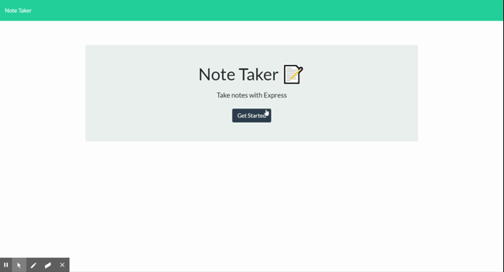

# Note Taker

## Table of Contents
 - [Description](#description)
 - [Usage](#usage)
 - [How It Works](#how-it-works)
    - [Express Server](#express-server)
    - [Data Management](#data-management)
    - [Unique Id](#unique-id)
 - [Application Link](#application-link)

## Description
This is a simple web application for taking and saving notes. Notes are stored in a database on an express server and will save and update in realtime for anyone visiting the website.

## Usage
Using the application is very easy and mostly self explainatory. To create a new note, click the pencil icon in the top right of the page. Fill in the note title and text and then click the save button, also in the top right.



Saved notes will appear in the left hand column. Click on a saved note to view its contents or click the red trash can icon to delete the saved note.

## How It Works
### Express Server
The application uses a basic express server and json file to handle requests and save data. 

```const express = require("express");
const app = express();
const PORT = process.env.PORT || 8080;

const apiRouter = require("./routes/apiRoutes");
const htmlRouter = require("./routes/htmlRoutes");

app.use(express.urlencoded({ extended: true }));
app.use(express.json());
app.use(express.static("public"));
app.use("/api", apiRouter);
app.use("/", htmlRouter);

app.listen(PORT, function() {
    console.log("Note Taker listening on PORT: " + PORT);
  });
```
### Data Management
The json file holds saved notes and the apiRoutes file handles requests to save, delete or retrieve the notes. It uses the unique id of each note to determine which one to delete.

```
router.get("/notes", (req, res) => {
    res.json(db);
})

router.post("/notes", (req, res) => {
    database.push(req.body);
    res.json(req.body);
    fs.writeFile("./db/db.json", JSON.stringify(database), (err) => {
        if (err) {
            return console.log(err);
        }
    })
})

router.delete("/notes/:id", (req, res) => {
    const id = req.params.id;

    for (let i = 0; i < database.length; i++) {
        if (id === database[i].id) {
           database.splice(i,1);
           res.json(true);
        }
    }
    fs.writeFile("./db/db.json", JSON.stringify(database), (err) => {
        if (err) {
            return console.log(err);
        }
    })
})
```
### Unique Id
To set a unique id for each note I used `Date.now()`. This method returns the number of milliseconds elapsed since January 1st, 1970. This was an appropriate method for this application because the user would not be saving multiple notes within the same millisecond. An alternative would be to run a loop thru the note list to check an id number against the existing id's until a unique number is found - this would ensure that every id is unique. Although `Date.now()` does not guarantee a unique number, the chances of someone submitting 2 or more notes in the exact same millisecond are slim to none.

## Application Link
A deployed version of this application can be found [here.](https://notetaker5000.herokuapp.com "Deployed Application")
